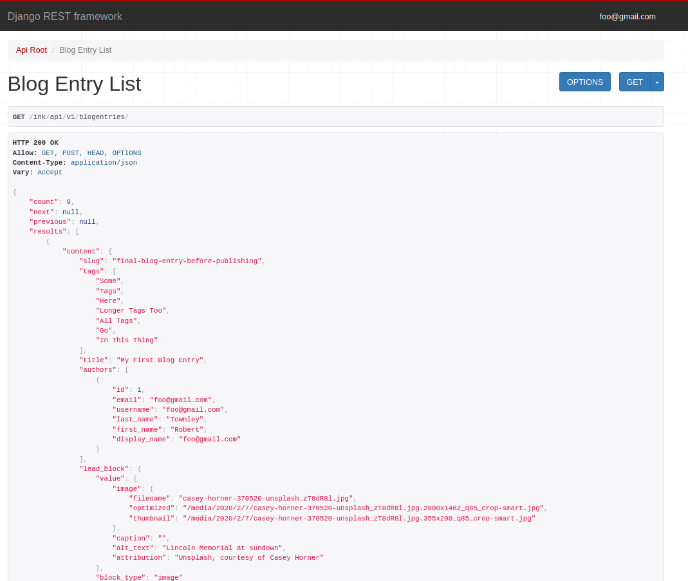

# Django Ink

Ink is a content management system designed from the ground up to integrate nicely
with the Django Admin. In contrast to Django's other excellent CMS options, Ink has
been built around three common pieces of content: Articles, Blog Entries, and Landing Pages.


Ink exposes these objects to the Django Admin, with pre-built editor interfaces
that facilitate efficient, media-rich content creation.


Content follows a state-based workflow, so an object can be edited and revised until
it's ready for publication. It can also be reverted back to a prior version with
a few clicks.


Following publication, all objects are made available through Django Rest Framework
API endpoints. The associated models, serializers, and viewsets behind these endpoints
can be customized as-needed. This means that Ink functions as a headless CMS without any
added configuration, and can communicate with any frontend application (including those
built with Vue or React) if you choose not to leverage Ink's built-in views and templates.





If you don't need a heavily-customized frontend, Ink also comes with views and templates
for quickly deploying a blog. This includes a ListView for displaying all blog posts,
and a DetailView for displaying a specific blog post. Both are built out with Material Design
using Vuetify, and support customization through Django settings variables that are
passed to the frontend app.


### Blog List Page


### Blog Detail Page


## Requirements
- The project is built with recent versions of Django in mind. For best results, use
  Django >= 3.0 with Python 3.6 or higher.
- Ink uses `JSONField` extensively, so your database must be PostgreSQL.
- The app uses Django Rest Framework. This is installed as a dependency, but you'll
  also need to add `rest_framework` to your `INSTALLED_APPS` if you'd like to use Ink's
  API endpoints.
- Thumbnails are generated through `easy_thumbnails`, which must be present
  in your `INSTALLED_APPS`.

## Installation
NOTE: The following installation steps assume familiarity with setting up a python
environment and Docker project. For a more detailed, beginner-friendly walk through,
refer to our [getting started guide](docs/getting_started.md).

- Install the library with `pip install ink-cms`
- Add the following three apps to your `settings.py`:
  ```
  INSTALLED_APPS = [
      ...
      "easy_thumbnails",
      "ink_cms",
      "rest_framework",
      ...
  ]
  ```
- Ensure that you have an entry for `ink_cms.urls` in your `urls.py`:
  ```
  from django.urls import include, path
  from ink_cms.views import BlogEntryDetailView, BlogEntryListView

  urlpatterns = [
      ...
      path("admin/", admin.site.urls),
      path("ink/", include("ink_cms.urls"))

      # Optional URLs for pre-built blog templates
      path("blog/", BlogEntryListView.as_view()),
      path("blog/<slug:slug>/", BlogEntryDetailView.as_view()),
      ...
  ]
  ```
- Run `python manage.py migrate`

## Usage
Log in to the Django Admin with either a superuser, or a user that has been given
read/write access over all objects within the `ink_cms` application.

You can edit `Article`, `BlogEntry`, or `Page` objects within the admin interface.
Saving an object creates a "Revision" that can be reverted back at any time within the
History panel at the top of the editor.

Only content that has been published is available to end users, so when your changes
are done, push "Save and Publish" to create a publication revision.

At that point, content is available to both the API endpoints, and the Django Views that
Ink provides.

## Configuration
See: [configuration](docs/configuration.md)

## Contributing
Contributions are greatly appreciated. The project has been designed to provide an
enjoyable experience for contributors as well as end users. Part of that work is a
fully-dockerized development environment, and instructions for how to get up and running.

To get started, visit our [contribution documentation](docs/contributing.md).

## Roadmap
Visit our [roadmap](docs/roadmap.md) to see what new features will be added soon,
and (after reviewing existing issues) feel free to file an issue request for things
that you'd like to see.

## License
This project is licensed under the MIT license.

## Support
If you are having issues, please let us know. Look through the project's existing issues
in GitHub, and then create a new one if your issue isn't covered.

## Thanks
From contibutors to end-users, thank you to everyone who's contributed to this project.

Special thanks in particular to the developers and maintainers behind these open source
tools, without which Ink would not be possible:
- Backend:
  - [Django](https://www.djangoproject.com/)
  - [Django Rest Framework](https://www.django-rest-framework.org/)
  - [Poetry](https://python-poetry.org/)
- Frontend:
  - [Vue](https://vuejs.org/)
  - [Vuetify](https://vuetifyjs.com/)
- Development
  - [Docker](https://www.docker.com/)
  - [Docker Compose](https://docs.docker.com/compose/)

Finally, if you'd like to support this project further, you can buy me a cup of coffee
through [GitHub Sponsors](https://github.com/sponsors/RobertTownley).
